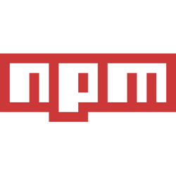

# NPM Commands

## npm version checking
### npm -v

 

## To find out usages of npm
### npm help

  

## To find out ways of installing individual npm files
### npm install -h

 

## To create package.json file
### npm init

 

## To create package.json file without typing out anything else
### npm init --yes
### or,
### npm init -y

 

## To set package.json defaults
### npm config set init-author-name "name"
### or,
### npm set init-license "name"

 

## To install a specific package
### npm install "package_name"
### or,
### npm i "package_name"

  

## To install a specific package just for development and not for production
### npm install "package_name" --save-dev
### or,
### npm i "package_name" -D

 

## To uninstall a package
### npm uninstall "name"

 

## To install a package globally
### npm install "package_name" -g

 

## To uninstall a package globally
### npm uninstall "package_name" -g

 

## To list down installed packages
### npm list

 

## To install a specific version of package
### npm install "package_name@version"
### Example - 3.4.1, here 3 is major version, 4 is minor version and 1 is patch version number

 

## To update a specific package
### npm install "package_name@latest"

 

## To remove any packages not listed in package.json
### npm prune

